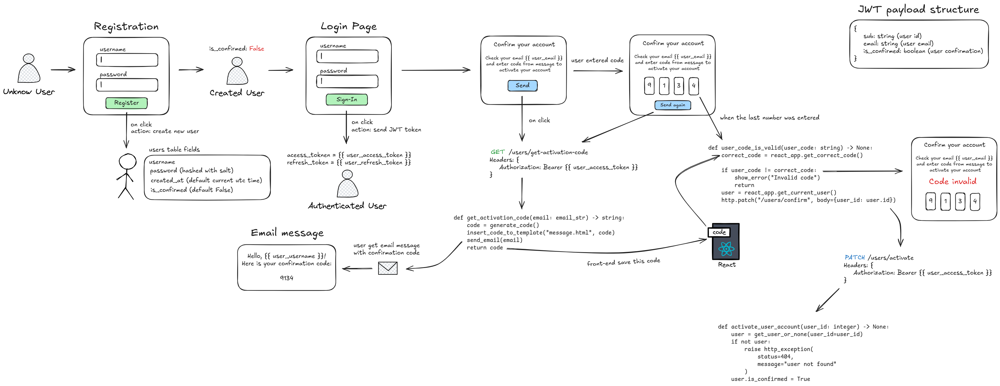

# Quick start:
- Clone repository:
    ~~~
    git clone https://github.com/abl1v1on/fastapi-confirm-acc-with-email.git
    ~~~
- Create venv and install dependencies:
    ~~~bash
    python3 -m venv .venv
    source .venv/bin/activate
    pip install -r requirements.txt
    ~~~
    If you use uv:
    ~~~
    uv sync
    ~~~
- Change .env file by .env-template:
    ~~~dotenv
    # .env-template
    DB__HOST=host
    DB__PORT=port
    DB__USER=user
    DB__PASS=pass
    DB__NAME=db_name
    ~~~
    ~~~bash
    mv .env-template .env
    ~~~
- Run docker-compose:
    ~~~bash
    # Maildev web client available on localhost:8080
    sudo docker-compose up -d
    ~~~
- Apply alembic migrations:
    ~~~bash
    alembic upgrade head
    ~~~
- Run fastapi:
    ~~~bash
    # Fastapi app available on localhost:8000
    python3 src/main.py
    ~~~
    If you user uv:
    ~~~bash
    uv run src/main.py
    ~~~

# Diagram

